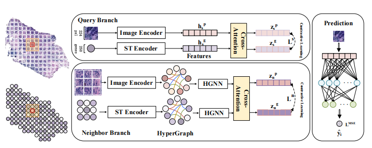

# NH²2ST #
***
**Spatially Gene Expression Prediction using Dual-Scale Contrastive Learning (MICCAI2025 Eealy Accept)**, [arXiv](https://arxiv.org/abs/2506.23827).

Mingcheng Qu, Yuncong Wu, Donglin Di, Yue Gao, Tonghua Su, Yang Song, Lei Fan*
***

*Summary*: We propose NH²2ST, a framework that integrates spatial context and both pathology and gene modalities for gene expression prediction. Our model comprises a query branch and a neighbor branch to process paired target patch and gene data and their neighboring regions, where cross-attention and contrastive learning are employed to capture intrinsic associations and ensure alignments between pathology and gene expression.



## Requirements
- Python 3.10.16
- Install the required packages by:
```bash
  pip install -r requirements.txt
```

## Data Preparation
### Step 1: Download Data
· STNet and Skin Dataset can be downloaded [here](https://drive.google.com/drive/folders/13oJqeoU5_QPy4_yeZ4eK694AGoBuQjop?usp=drive_link).\
· PCW and Mouse Dataset from STimage-1K4M can be downloaded according to [STimage-1K4M](https://github.com/JiawenChenn/STimage-1K4M).\
· INT and ZEN (including ZEN40-ZEN49) datasets from HEST-1k can be downloaded according to [HEST-1k](https://github.com/mahmoodlab/hest).
Save these datasets to ./data within your project workspace, the structure of ./data is:
```
    ├── data
    │   ├── STNet
    │   ├── Skin
    │   ├── STimage-1K4M
    │   │   ├── PCW
    │   │   └── Mouse
    │   └──HEST-1k
    │       └──ST
    │           ├── INT
    │           └── ZEN
    ├──weights
```

### Step 2: Crop the target patch.
To facilitate subsequent processing, cut the WSI into sizes of 224*224. Modify the parameters according to the dataset to be processed and run:
```python
    python get_patch_csv.py XXX
```
XXX represents the datdaset you want to preprocess, e.g. "python get_patch_csv.py skin".

### Step 3: Copy the gene list.
The selected genes are stored in .npy files. Simply unzip the genes.zip file and place the .npy files into the corresponding directory (e.g., gene_INT.npy and gene_ZEN.npy should be placed in the HEST-1k directory).

### Step 4: Download Pre-trained Weights
Our model utilizes a pre-trained ResNet18 model to extract features. You can download the pre-trained weights from [resnet18](https://github.com/ozanciga/self-supervised-histopathology/releases/download/tenpercent/tenpercent_resnet18.ckpt). Please save the weights to the weights directory, as shown in the structure diagram above.

## Training and Testing
- STNet
```python
    # Train
    python main.py --config stnet/TRIPLEX --mode cv --gpu [gpu_ids]
    # Test
    python main.py --config stnet/TRIPLEX --mode test --fold [num_fold] --model_path [path/model/weight]
```
- Skin
```python
    # Train
    python main.py --config skin/TRIPLEX --mode cv --gpu [gpu_ids]
    # Test
    python main.py --config skin/TRIPLEX --mode test --fold [num_fold] --model_path [path/model/weight]
```
- PCW
```python
    # Train
    python main.py --config STimgae-1K4M/TRIPLEX --mode cv --gpu [gpu_ids]
    # Test
    python main.py --config STimgae-1K4M/TRIPLEX --mode test --fold [num_fold] --model_path [path/model/weight]
```
- Mouse
```python
    # Train
    python main.py --config STimgae-1K4M/TRIPLEX --mode cv --gpu [gpu_ids]
    # Test
    python main.py --config STimgae-1K4M/TRIPLEX --mode test --fold [num_fold] --model_path [path/model/weight]
```
- INT
```python
    # Train
    python main.py --config HEST-1k/TRIPLEX --mode cv --gpu [gpu_ids]
    # Test
    python main.py --config HEST-1k/TRIPLEX --mode test --fold [num_fold] --model_path [path/model/weight]
```
- ZEN
```python
    # Train
    python main.py --config HEST-1k/TRIPLEX --mode cv --gpu [gpu_ids]
    # Test
    python main.py --config HEST-1k/TRIPLEX --mode test --fold [num_fold] --model_path [path/model/weight]
```
**Explanation**:
- `--gpu [gpu_ids]`: Our model supports multi-GPU training. You can specify multiple GPU IDs separated by spaces to utilize multiple GPUs. For example, `--gpu 1 2` will use GPUs with IDs 1 and 2.
- `--config`: Specifies the path to the configuration file. The configuration file contains model hyperparameters and training settings. You can modify these parameters to suit your experimental needs. For example:
    ```yaml
    GENERAL:
      seed: 2021
      log_path: ./logs
  
    TRAINING:
      num_k: 4
      batch_size: 8
      loss: MSE
      optimizer: adam
      learning_rate: 5.0e-4
      num_epochs: 200
      early_stopping:
        monitor: R
        patience: 20
        mode: max

    MODEL:
      name: NG2ST
      num_genes: 250
      emb_dim: 512
      depth1: 1
      num_heads1: 8
      mlp_ratio1: 1
      dropout1: 0.5
      res_neighbor: (5, 5)
      learning_rate: 0.0005
      temperature1: 0.05
      temperature2: 0.05
      loss_ratio1: 1.0
      loss_ratio2: 0.5
    ```
## Visualization
To perform visualization, first test on the test set, save the predicted values, and then run plot.py to visualize the results.

```python
    python plot.py
```
To modify the genes to be plotted, edit the NGHist2ST file. The style of the figures can be modified in plot.py.


## Acknowledgements
Our work has benefited significantly from the foundational contributions of the TRIPLEX framework, as presented in the CVPR paper "Accurate Spatial Gene Expression Prediction by Integrating Multi-Resolution Features" by Y. Chung et al. We are grateful to the authors for their pioneering work and for making their research publicly available.

## Citation

```bibtex
@misc{qu2025spatiallygeneexpressionprediction,
      title={Spatially Gene Expression Prediction using Dual-Scale Contrastive Learning}, 
      author={Mingcheng Qu and Yuncong Wu and Donglin Di and Yue Gao and Tonghua Su and Yang Song and Lei Fan},
      year={2025},
      eprint={2506.23827},
      archivePrefix={arXiv},
      primaryClass={cs.CV},
      url={https://arxiv.org/abs/2506.23827}, 
}
